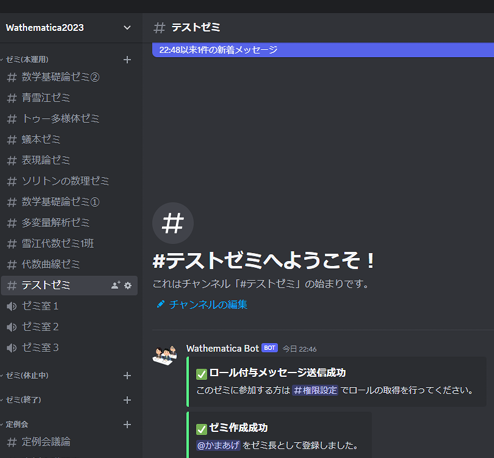

# begin コマンドの使い方

* [TODO]: ここに `/begin` コマンドの使い方を書く

ゼミ(仮立て)にあるゼミをゼミ(本運用)へ移すコマンド \
**動かしたいゼミのチャンネル内**で`/begin`と送信 \
例えばゼミ(仮立て)にある「テストゼミ」を本運用にしたい場合，このチャンネルで \
 \
上のように送信すると次のようになる \
 \
ちゃんとゼミ(本運用)に移行できたことがわかる

目的外のチャンネルで`/begin`を使うとこのようなエラーが表示される \
