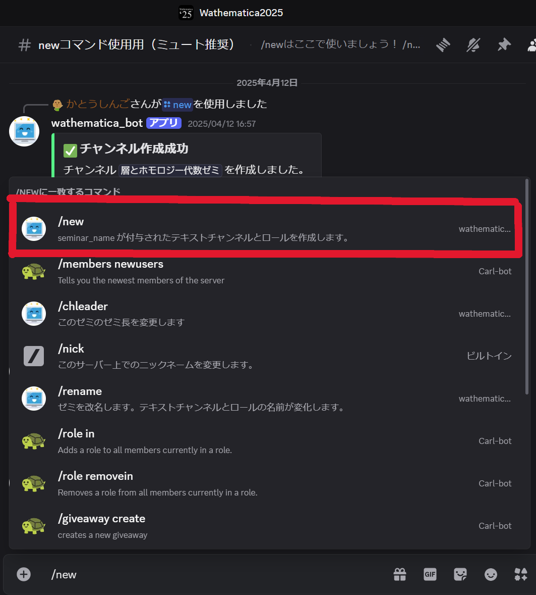

# New コマンドの使い方

* [TODO] ここに `/new` コマンドの使い方を書く

ゼミ(仮立て)カテゴリに新しくゼミを立てることができる

**#newコマンド使用用（ミュート推奨）** で`/new`とうち，上画像の赤い四角のコマンドを選択すると
 \
のように出てくる。このまま送信するとゼミ(仮立て)カテゴリに上記でいう「テストゼミ」が作られる \

* 「ゼミ長」とは
`/new`コマンドを使用した人が「ゼミ長」として登録される \
ゼミの削除(`/delete`)，ゼミ(休止中)への移行(`/pause`)はゼミ長しかできない \
`/chleader`コマンドでゼミ長変更ができる
